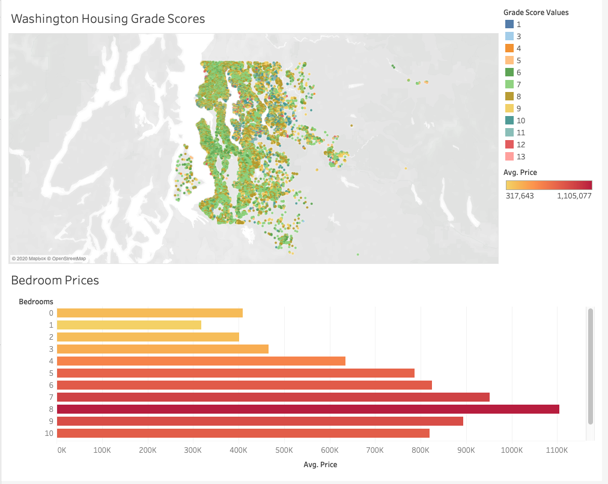

# Housing Analysis :house_with_garden:
## Based on a dataset provide of the Seattle Neighborhood Area

**An assignment to do a brief analysis on housing data**

*Questions Include:*
* How many houses were built before 1979?
* What is the most expensive area by zipcode in the dataset?
* How do grade scores compare across the Seattle area?
* What are the average price comparisons by number of rooms within a house?

